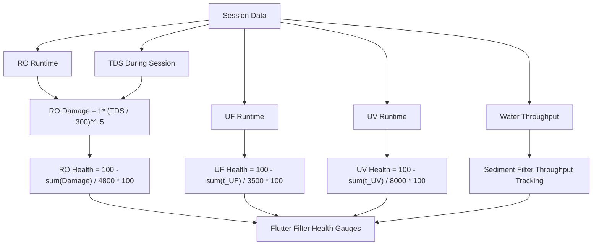

# Filter Health Model

Label: Conceptual dashboard model based on documented formulas

## Notes

- The model supports maintenance planning in the dashboard.
- The values are estimates, not certified remaining-life measurements.
