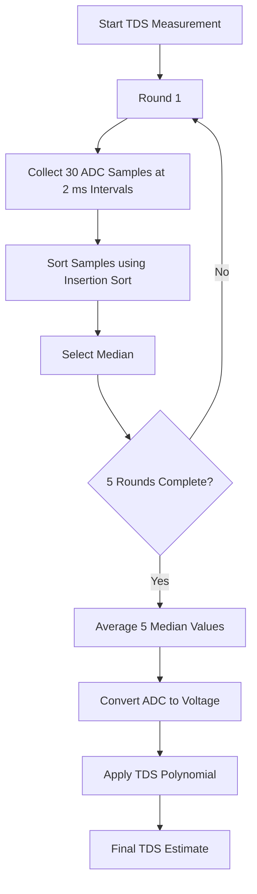

# Filtering Algorithm

Label: Implemented


```mermaid
flowchart TD
    A["Start TDS Measurement"] --> B["Round 1"]
    B --> C["Collect 30 ADC Samples at 2 ms Intervals"]
    C --> D["Sort Samples using Insertion Sort"]
    D --> E["Select Median"]
    E --> F{"5 Rounds Complete?"}
    F -- "No" --> B
    F -- "Yes" --> G["Average 5 Median Values"]
    G --> H["Convert ADC to Voltage"]
    H --> I["Apply TDS Polynomial"]
    I --> J["Final TDS Estimate"]
```

```text
TDS = (133.42 * V^3 - 255.86 * V^2 + 857.39 * V) * 0.5
```
