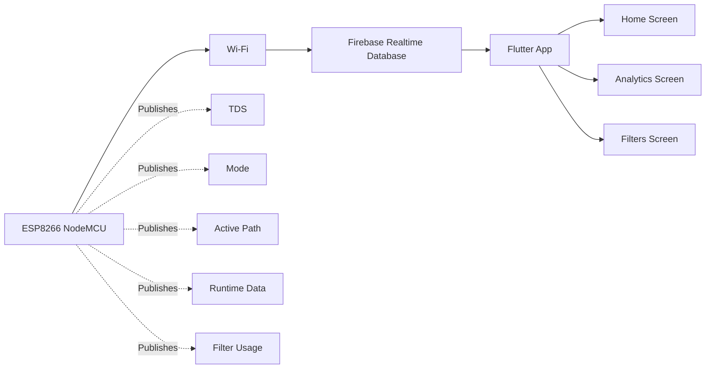

# Firebase Pipeline

Label: Implemented architecture, dashboard presentation documented conceptually

## Scope Boundary

The project uses Firebase and Flutter. No additional cloud analytics platform is claimed.
