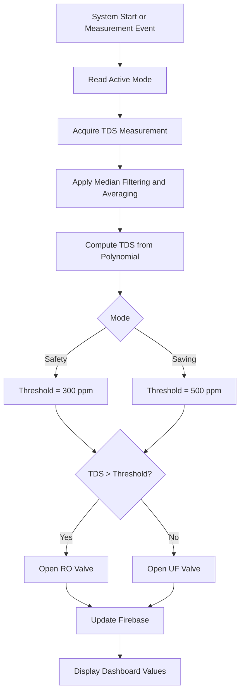

# Functional Flow

Label: Implemented

```mermaid
flowchart TD
    A["System Start or Measurement Event"] --> B["Read Active Mode"]
    B --> C["Acquire TDS Measurement"]
    C --> D["Apply Median Filtering and Averaging"]
    D --> E["Compute TDS from Polynomial"]
    E --> F{"Mode"}
    F -- "Safety" --> G["Threshold = 300 ppm"]
    F -- "Saving" --> H["Threshold = 500 ppm"]
    G --> I{"TDS > Threshold?"}
    H --> I
    I -- "Yes" --> J["Open RO Valve"]
    I -- "No" --> K["Open UF Valve"]
    J --> L["Update Firebase"]
    K --> L
    L --> M["Display Dashboard Values"]
```
