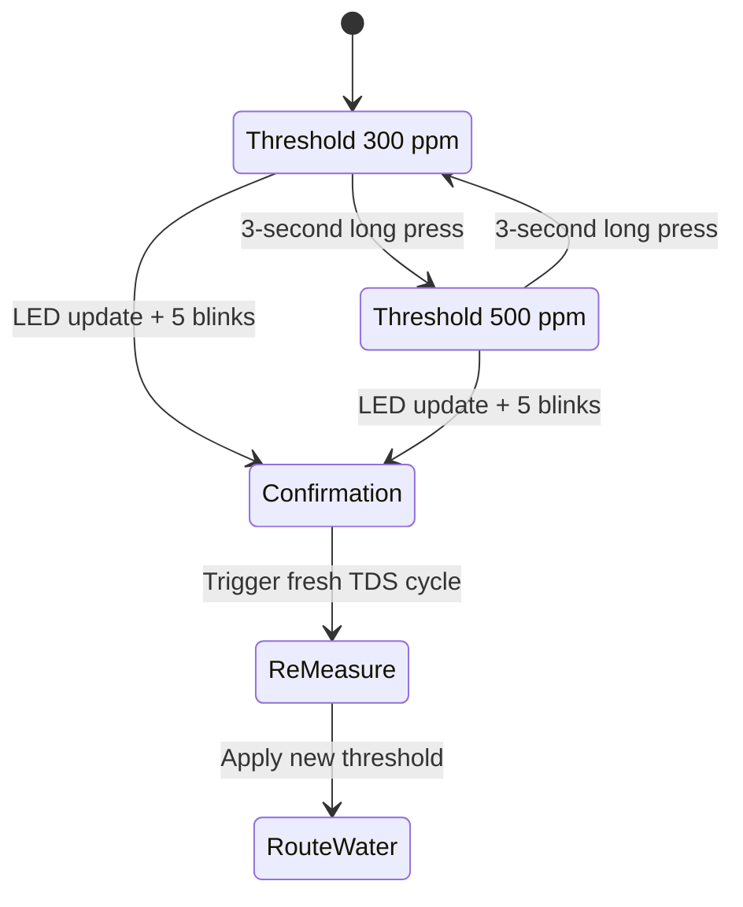

# Mode Switching

Label: Implemented

## Notes

- Safety Mode is indicated by the green LED.
- Saving Mode is indicated by the red LED.
- The source document states that the routing decision is re-evaluated after mode change.
