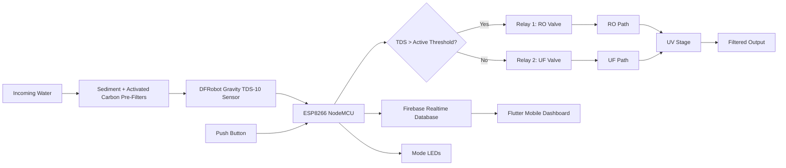

# System Architecture

Label: Implemented laboratory prototype with conceptual mobile presentation layer

## Notes

- The water-routing controller and relay actuation are documented as implemented in the laboratory prototype.
- The Flutter/Firebase dashboard is documented in the primary source as the monitoring architecture and screen design.
