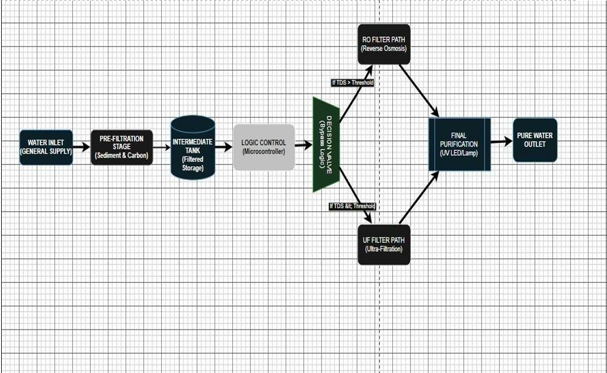
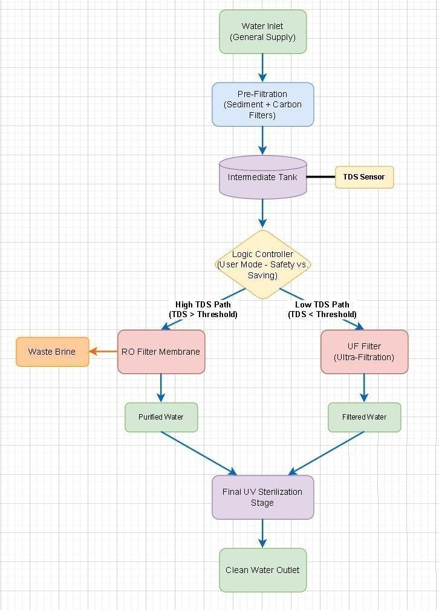
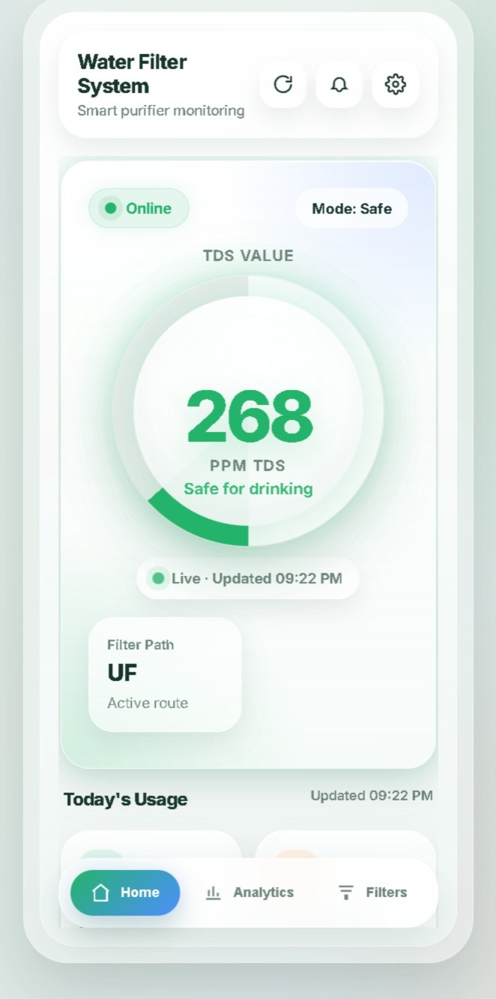
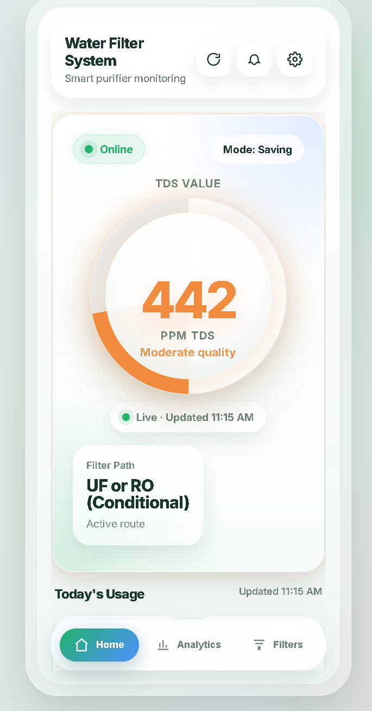
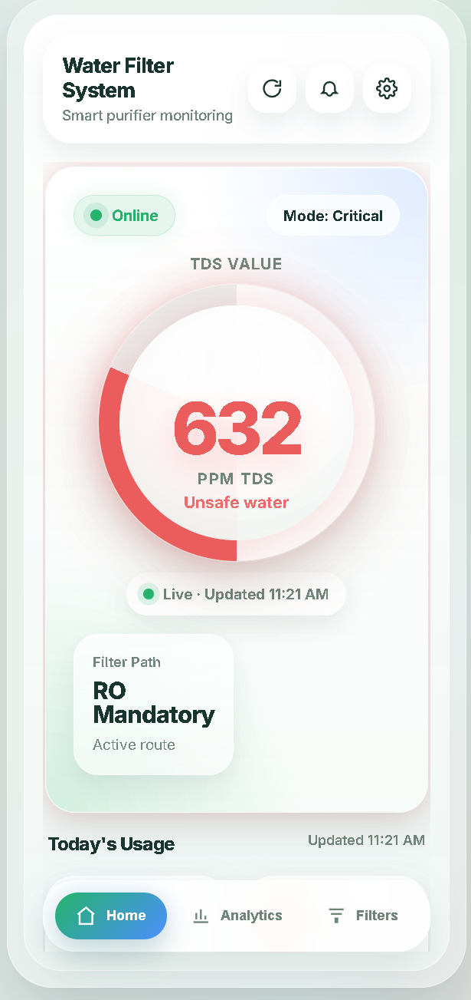
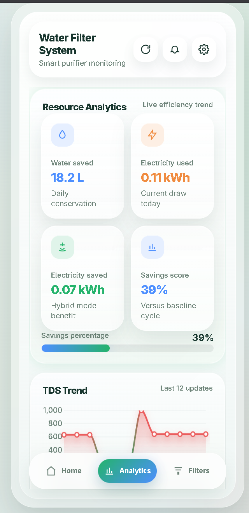
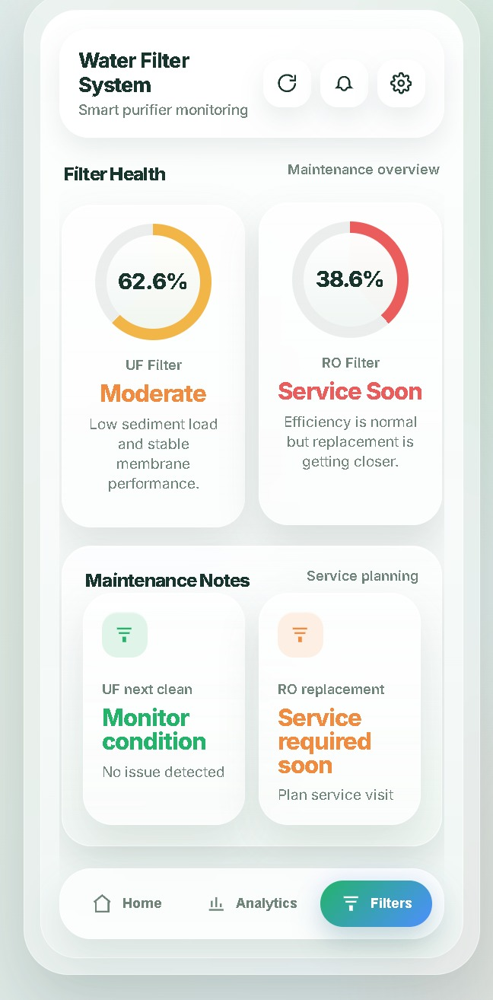
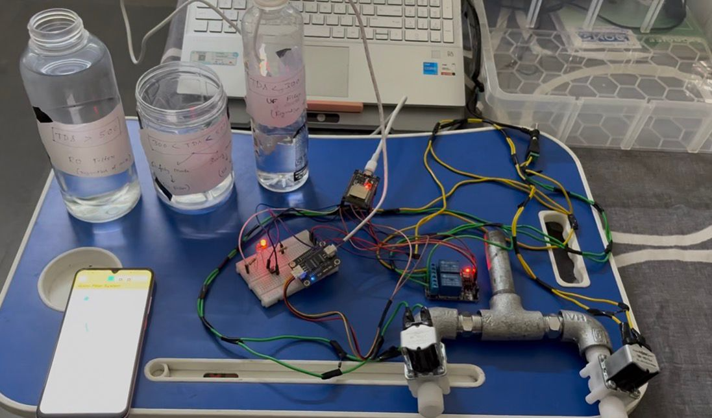
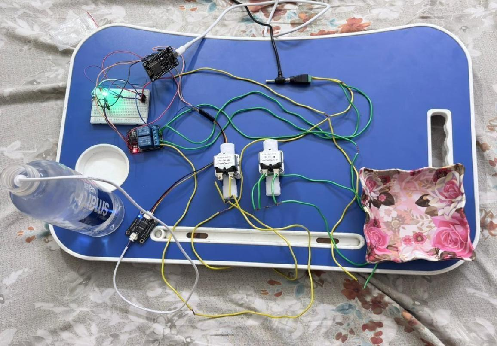

# Figures and Tables

This page preserves and catalogs visual and tabular material from the primary document. Embedded images extracted from the DOCX are stored in [images/](../images/). Prototype photographs are also copied into [prototype/](../prototype/).

## Figures and Visuals

### Source Cover Page

Original context: institutional cover page for the invention disclosure document.

### Figure 6.1 - System Architecture Block Diagram

Original context: Section 6, working principle of the invention. Purpose: shows the high-level architecture of the TDS sensing, ESP8266 processing, relay actuation, Firebase, and Flutter dashboard flow.

Related documentation:

- [Mermaid system architecture](../diagrams/system_architecture.md)
- [README system architecture](../README.md#system-architecture)

### Figure 6.2 - Functional Flow Diagram

Original context: Section 6, working principle. Purpose: shows the firmware decision flow from TDS measurement to route selection.

Related documentation:

- [Mermaid functional flow](../diagrams/functional_flow.md)
- [Firmware threshold logic](../firmware/adaptive_threshold_logic.md)

### Figure 7.6.1 - Home Screen Dashboard, Safe Water Case

Original caption context: `TDS: 268 ppm | Gauge: green | Status: Safe for drinking | Mode: Safe | Path: UF | UF today: 1h 59m | RO today: 0h 36m | Water saved: 31.4 L`

Purpose: demonstrates the mobile dashboard state for a low-TDS case routed through UF.

### Figure 7.6.2 - Moderate-Quality Water Case

Original caption context: `TDS: 442 ppm | Gauge: amber | Status: Moderate quality | Mode: Saving | Path: UF or RO (Conditional) | UF today: 1h 34m | RO today: 1h 06m | Water saved: 23.9 L`

Purpose: demonstrates dashboard behavior for an intermediate TDS value near the adaptive threshold range.

### Figure 7.6.3 - High-TDS Routing Example

Original caption context: `TDS: 719 ppm | Gauge: red | Status: High TDS - RO required | Mode: Saving | Path: RO | UF today: 1h 11m | RO today: 1h 46m | Water saved: 0 L`

Purpose: demonstrates dashboard behavior when RO routing is required.

### Figure 7.6.4 - Analytics Screen, Resource Analytics and TDS Trend

Original caption context: Analytics screen displaying 18.2 L water saved, 0.11 kWh electricity consumed, 0.07 kWh electricity saved, and a 39% savings score versus baseline, alongside a TDS trend graph.

Purpose: shows the resource analytics view described in the Flutter dashboard.

### Figure 7.6.5 - Analytics Screen, TDS Trend and Lifetime Usage

The primary document captions a second analytics view as Figure 7.6.5, describing a continued TDS trend and lifetime usage chart over March 1-13 with water savings reaching approximately 600 L.

No uniquely caption-matched image file could be identified from the extracted DOCX media order. Auxiliary extracted media are preserved in [images/](../images/) with original source-style filenames.

### Figure 7.6.7 - Filter Health Dashboard

Original caption context: `UF health: 98% - Good | RO health: 97% - Good | UF next clean: No issue detected | RO replacement: No service required`

Purpose: shows filter health and service-planning display concepts for the mobile dashboard.

### Figure 8.8a - Prototype Experimental Setup

Original context: Section 8.8, hardware prototype photographs.

Purpose: documents the physical laboratory prototype setup.

### Figure 8.8b - Prototype Experimental Setup

Original context: Section 8.8, hardware prototype photographs.

Purpose: documents the physical laboratory prototype setup.

### Auxiliary Extracted Media

The DOCX contained additional embedded media files without clearly recoverable nearby captions in the extracted document order:

- [source-image5.png](../images/source-image5.png)
- [source-image7.png](../images/source-image7.png)
- [source-image9.png](../images/source-image9.png)
- [source-image11.png](../images/source-image11.png)

These files are preserved for completeness, but this repository does not assign unsupported figure numbers or meanings to them.

## Tables

### Prior Patents and Publications Table

Original context: Section 3. Purpose: compares relevant prior art and explains how the project differs.

| Patent / Publication | Applicant / Author | Description | Relevance to This Project |
| --- | --- | --- | --- |
| IN Patent 583362 | AO Smith India Water Products Pvt Ltd | Convertible water purifier that switches purification technology based on inlet TDS. | Related TDS-routing prior art; project differs through ESP8266 control, UF/RO routing, user-selectable thresholds, and statistical filtering. |
| IN Application 202541113369 | Lendi Institute of Engineering and Technology | Multi-stage filtration system with TDS-based routing to UF, RO plus mineral cartridge, or RO. | Related multi-path routing concept; project differs through Wi-Fi-capable ESP8266, Safety/Saving thresholds, event-driven sensing, and filtering algorithm. |
| IN Patent 547195 | Eureka Forbes Ltd. | Monitoring system for purifier mode selection using water quality data, wireless communication, and alerts. | Related monitoring and mode-selection concept; project focuses on low-cost embedded actuation with physical dual-valve routing. |
| CN104710047A | Chuzhou Dongrun Electronic Technology Co., Ltd. | RO-centric water-saving system with TDS and temperature monitoring. | Related RO water management; project routes between UF and RO to avoid unnecessary RO treatment. |

### Objectives Table

Original context: Section 5. Purpose: lists project objectives, including dual-path routing, reject-water reduction, mode control, stable measurement, mobile monitoring, and low-cost implementation.

| # | Objective |
| ---: | --- |
| 1 | Design and implement a dual-path RO + UF routing controller based on measured TDS. |
| 2 | Reduce unnecessary reject water by routing acceptable-quality water through UF. |
| 3 | Reduce RO maintenance burden by limiting RO exposure to higher-TDS events. |
| 4 | Provide Safety Mode and Saving Mode threshold control. |
| 5 | Achieve stable TDS measurement using statistical filtering. |
| 6 | Provide a Flutter + Firebase monitoring dashboard. |
| 7 | Target a low-cost household upgrade concept using accessible hardware. |

### Functional Layers Table

Original context: Section 7.1. Purpose: defines the sensor, processing, decision, actuation, user interface, and remote monitoring layers.

| Layer | Description |
| --- | --- |
| Sensor Layer | DFRobot Gravity TDS-10 analog probe, conductivity signal conditioning, ESP8266 ADC input. |
| Processing Layer | ESP8266 NodeMCU v3 executes ADC sampling, filtering, TDS computation, threshold comparison, relay control, and Wi-Fi transmission. |
| Decision Layer | Compares computed TDS against 300 ppm Safety or 500 ppm Saving threshold. |
| Actuation Layer | 2-channel relay module drives 12V normally closed RO and UF solenoid valves. |
| User Interface Layer | Push button for 3-second long-press mode toggle, green/red LEDs, 5-blink confirmation. |
| Remote Monitoring Layer | ESP8266 Wi-Fi to Firebase Realtime Database to Flutter mobile dashboard. |

Related documentation: [README system architecture](../README.md#system-architecture).

### Hardware Components Table

Original context: Section 7.2. Purpose: lists ESP8266 NodeMCU, DFRobot Gravity TDS-10 sensor, relay module, RO/UF valves, LEDs, push button, power supply, and resistors.

| Component | Model / Specification | Qty | Purpose |
| --- | --- | ---: | --- |
| ESP8266 NodeMCU | v3, 80 MHz, 4 MB flash, built-in Wi-Fi | 1 | Main microcontroller and cloud gateway |
| TDS Sensor Module | DFRobot Gravity TDS-10, 0-1000 ppm, analog 0-2.3 V | 1 | Real-time water quality sensing |
| 2-Channel Relay Module | 5V coil, 10A contact, optocoupler-isolated | 1 | RO / UF valve switching |
| Solenoid Valve, RO Path | 12V DC, normally closed, G1/4 thread | 1 | Opens RO membrane inlet |
| Solenoid Valve, UF Path | 12V DC, normally closed, G1/4 thread | 1 | Opens UF membrane inlet |
| Green LED | 5 mm, 20 mA | 1 | Safety Mode indicator |
| Red LED | 5 mm, 20 mA | 1 | Saving Mode indicator |
| Push Button | Momentary tactile switch | 1 | Mode selection |
| 12V DC Power Supply | 12V 2A regulated adapter | 1 | System power rail |
| Current-Limiting Resistors | 330 ohm | 2 | LED protection |

Related documentation:

- [Hardware components](../hardware/components.md)
- [Bill of materials](../hardware/bill_of_materials.md)

### Mode Comparison Table

Original context: Section 7.4. Purpose: compares Safety Mode at 300 ppm and Saving Mode at 500 ppm, including indicator LED and intended use.

| Mode | TDS Threshold | Indicator | Intended Use Case |
| --- | ---: | --- | --- |
| Safety Mode | 300 ppm | Green LED | Stricter routing for households requiring higher water-quality caution. |
| Saving Mode | 500 ppm | Red LED | More UF routing where source water is acceptable, supporting conservation. |

Related documentation: [Adaptive threshold logic](../firmware/adaptive_threshold_logic.md).

### Filter Health Models Table

Original context: Section 7.5. Purpose: documents model formulas and rated limits for RO membrane, UF membrane, UV lamp, and sediment pre-filter.

| Component | Health Model | Rated Limit |
| --- | --- | --- |
| RO Membrane | `H_RO = 100 - (sum(Damage_i) / 4800) * 100`; `Damage_i = t_i * (TDS_i / 300)^1.5` | 4,800 damage-units |
| UF Membrane | `H_UF = 100 - (sum(t_UF) / 3500) * 100` | Approximately 3,000-3,500 h |
| UV Lamp | `H_UV = 100 - (sum(t_UV) / 8000) * 100` | 8,000 h |
| Sediment Pre-filter | Volumetric throughput tracking | 6,000-8,000 L typical service interval |

Related documentation: [Filter health models](../mobile-dashboard/filter_health_models.md).

### Experimental Setup Table

Original context: Section 8.1. Purpose: records the ESP8266, TDS sensor, reference instrument, logging method, ambient conditions, trial duration, RO/UV/UF power values, and filter-rating constants.

| Parameter | Specification |
| --- | --- |
| Microcontroller | ESP8266 NodeMCU v3 at 80 MHz, 4 MB flash |
| TDS Sensor | DFRobot Gravity TDS-10, 0-1000 ppm, analog 0-2.3 V output |
| Reference Instrument | HANNA HI9813-6 portable TDS/pH/EC/temperature meter |
| Data Logging | Flutter + Firebase mobile app; session-level logging |
| Ambient Conditions | 25 +/- 1 deg C laboratory |
| Trial Duration | 100 operational hours across three water samples |
| RO Power | 60 W |
| RO Reject Ratio | 3:1 |
| UV Lamp Power | 11 W |
| UF Path Power | 5 W |
| UF Membrane Rated Life | 3,500 h |
| RO Membrane Damage Limit | 4,800 damage-units |

Related documentation: [100-hour validation](../experiments/100_hour_validation.md).

### Water Sample Table

Original context: Section 8.2. Purpose: identifies Samples A, B, and C, including source, target TDS, measured TDS, trial hours, and modes tested.

| Sample | Source | Target TDS | Measured TDS | Trial Hours | Modes Tested |
| --- | --- | --- | ---: | ---: | --- |
| A | Vellore municipal drinking water | 70-80 ppm | 75.4 +/- 1.2 ppm | 40 h | Safety + Saving |
| B | Mixed municipal and groundwater supply from residential apartment usage in Vellore | 410-420 ppm | 415.8 +/- 2.1 ppm | 35 h | Safety + Saving |
| C | Borewell groundwater sample from Vellore urban residential area | 720 ppm | 719.3 +/- 3.6 ppm | 25 h | Safety + Saving |

Related documentation: [100-hour validation](../experiments/100_hour_validation.md).

### Routing Validation Results Table

Original context: Section 8.4. Purpose: validates expected path, actual path, and latency for each sample and mode.

| Sample / TDS | Mode | Threshold | Expected Path | Actual Path | Latency |
| --- | --- | ---: | --- | --- | ---: |
| A - 75 ppm | Safety | 300 ppm | UF | UF | 218 ms |
| A - 75 ppm | Saving | 500 ppm | UF | UF | 214 ms |
| B - 416 ppm | Safety | 300 ppm | RO | RO | 221 ms |
| B - 416 ppm | Saving | 500 ppm | UF | UF | 219 ms |
| C - 719 ppm | Safety | 300 ppm | RO | RO | 222 ms |
| C - 719 ppm | Saving | 500 ppm | RO | RO | 220 ms |

Related documentation: [Routing accuracy](../experiments/routing_accuracy.md).

### Energy and Water Conservation Results Table

Original context: Section 8.5. Purpose: summarizes UF runtime, RO runtime, energy consumed, energy saved, reject avoided, and savings percentage during the 100-hour trial.

| Sample | Total | UF | RO | Energy Consumed | Energy Saved | Reject Avoided | Savings |
| --- | ---: | ---: | ---: | ---: | ---: | ---: | ---: |
| A - 75 ppm | 40.0 h | 40.0 h | 0.0 h | 0.640 kWh | 2.200 kWh | 7,200 L | 77.5% |
| B - 416 ppm | 35.0 h | 17.5 h | 17.5 h | 1.531 kWh | 0.963 kWh | 3,150 L | 38.6% |
| C - 719 ppm | 25.0 h | 0.0 h | 25.0 h | 1.775 kWh | 0.000 kWh | 0 L | 0.0% |
| Total | 100.0 h | 57.5 h | 42.5 h | 3.946 kWh | 3.163 kWh | 10,350 L | 44.5% |

Related documentation: [Energy analysis](../experiments/energy_analysis.md).

### Filter Health After 100-Hour Trial Table

Original context: Section 8.6. Purpose: reports estimated remaining health after the laboratory validation trial.

| Component | Model | Exposure | Rated Limit | Health Remaining |
| --- | --- | ---: | ---: | --- |
| RO Membrane | Power-law `(TDS/300)^1.5` | 143.34 damage-units | 4,800 units | 97.01%, Healthy |
| UF Membrane | Linear runtime | 57.5 h | 3,500 h | 98.36%, Healthy |
| UV Lamp | Linear runtime | 100.0 h | 8,000 h | 98.75%, Healthy |
| Sediment Pre-filter | Volumetric throughput | Approximately 6,000 L | 6,000-8,000 L | Approximately 90-95%, Monitor |

Related documentation: [Filter lifetime estimation](../experiments/filter_lifetime_estimation.md).

### Always-RO Baseline Comparison Table

Original context: Section 8.7. Purpose: compares the smart-routing system against an always-RO baseline for energy, RO damage, reject water, projected membrane life, and maintenance cost.

| Metric | Always-RO Baseline | This System |
| --- | ---: | ---: |
| Total energy consumed | 7.100 kWh | 3.938 kWh |
| RO membrane damage-units | 329.2 | 143.3 |
| Reject water generated | 18,000 L | 7,650 L |
| Projected RO membrane life | Approximately 1,459 h | Approximately 3,349 h |
| Estimated annual maintenance cost | Rs. 4,500-7,000 | Reduced because of RO usage reduction |

Related documentation: [Energy analysis](../experiments/energy_analysis.md).

## Documentation Honesty

- Figure numbering and captions are preserved where the DOCX provided recoverable captions.
- Embedded source images are preserved as files.
- Placeholder descriptions are used only where an image is referenced by the document but not clearly mapped to an extracted file.
- No new experimental data, performance values, or visual claims are invented.
